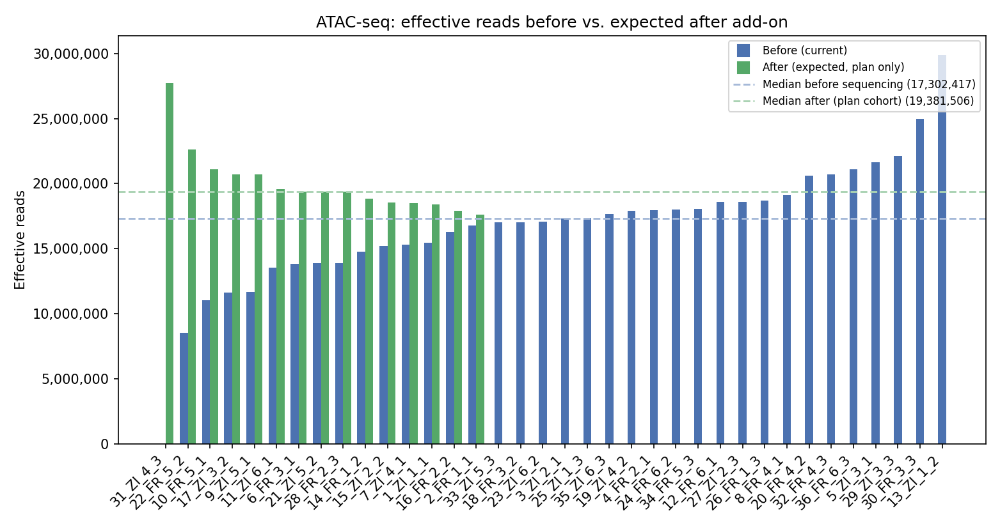
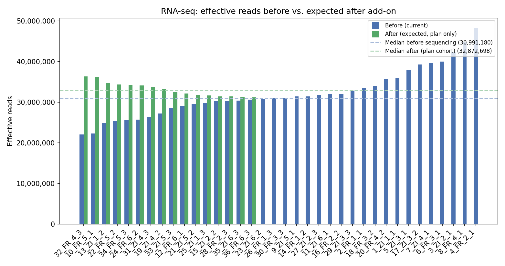
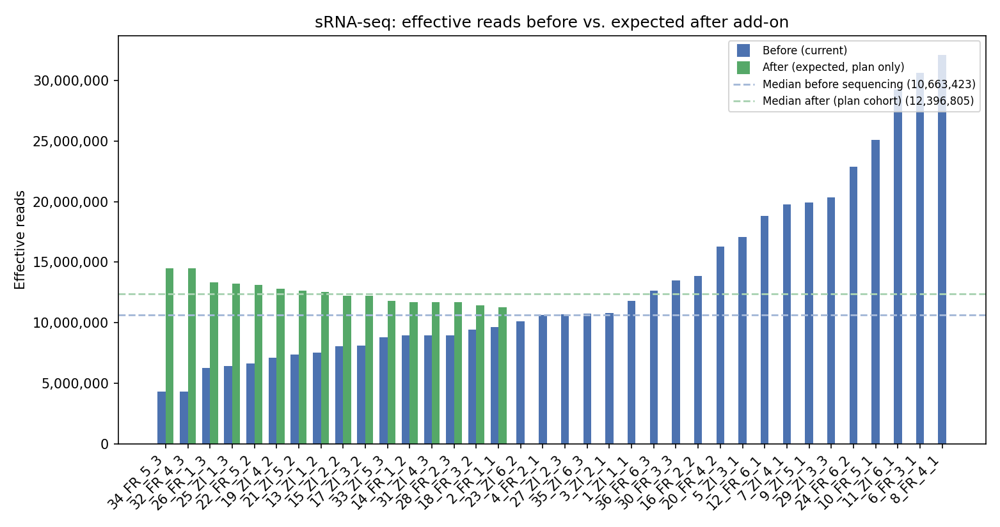

# Add-on UG sequencing plan

This folder contains a small pipeline that decides **which libraries get a second round of sequencing**, how many **raw single-end reads** each should receive under a **5 billion total cap**, and **pooling volumes** for four separate Illumina pools.

## What it does

1. **Reads MultiQC-style metrics** for ATAC-seq, RNA-seq, and small RNA-seq and defines **effective reads** per omic (see below).
2. **Computes a per-omic median** of effective reads, selects libraries **below that median** (with optional caps per omic), and ranks them by **how many effective reads are missing to reach the median**.
3. **ATAC-seq exception:** sample `31_ZI_4_3` is handled separately (contaminated original run; median is computed **without** this sample; it is **always** included with a “full median” effective-read target for the replacement library). It appears **first** among ATAC-seq rows in the CSV (single-library pool **ATAC-seq_1**).
4. Converts each library’s **effective-read deficit** into **raw reads to sequence** using **demultiplexing** statistics (`sample_counts`, `assigned_reads` / `total_reads`).
5. Applies a **uniform scale** so the sum of **allocated raw reads** across all selected libraries equals **5,000,000,000** (largest-remainder integer split).
6. Writes a **CSV** read plan and, unless skipped, a **four-sheet Excel workbook** for pooling (template layout, canonical sample IDs in the name column).

## Requirements

- Python ≥ 3.10  
- [uv](https://github.com/astral-sh/uv) (recommended)

Dependencies are declared in [`pyproject.toml`](pyproject.toml) (`pandas`, `numpy`, `matplotlib`, `openpyxl`). From this directory:

```bash
uv sync
```

## Inputs

All default paths are under **`data/input/`**. MultiQC exports and demux JSONs are stored with the **same relative paths** they had in the parent **Dmel_cold_adapt_multiomics** repository (so you can compare or replace them with fresh exports from your own pipeline tree). Pooling **templates** live at the **`data/input/`** root.

| Role | Path under `data/input/` | Original location in multiomics repo |
|------|---------------------------|----------------------------------------|
| ATAC effective reads (MultiQC) | `atac-seq/data/output/multiqc/broad_peak/ATAC-seq_36_samples_UG_SE_multiqc_report_data/mqc_picard_alignment_summary__name_Aligned_Reads_ylab_Reads_cpswitch_counts_label_Number_of_Reads_.txt` | same path under repo root |
| RNA effective reads (MultiQC) | `rna-seq/data/output/multiqc/star_rsem/multiqc_report_data/multiqc_star.txt` | same |
| sRNA effective reads (MultiQC) | `srna-seq/data/output/multiqc/smallRNA-seq-analysis-of-Dmel-cold-adaptation-samples_multiqc_report_data/mirtrace_rna_categories_plot.txt` | same |
| Demultiplexing stats (ATAC / RNA / sRNA) | `data_UG_seq/data/de-multiplexed_reads/{atacseq,rnaseq,smallrna}/demux_stats.json` | same |
| RNA + small RNA pooling template | `2025-12-03_pooling_WS.xlsx` | `add_on_sequencing_plan/data/input/` in multiomics |
| ATAC pooling template | `pooling_for_ngs_all_samples.xlsx` | `add_on_sequencing_plan/data/input/` in multiomics |

Replace any of these files (keeping the path or passing `--atac-multiqc`, `--rna-multiqc`, etc.) when you rerun the plan for a new cohort.

A local **`prompt.md`** (project rules) may exist in your checkout; it is **gitignored** in the standalone layout so it is not pushed by default.

## Quick start

From this directory as the **repository root** (`add_on_sequencing_plan/`):

```bash
uv run python code/plan_addon_sequencing.py
```

Defaults read the bundled files under **`data/input/`** as listed above. Override paths with CLI flags if you keep data elsewhere.

### Example: cap how many below-median samples per omic

```bash
uv run python code/plan_addon_sequencing.py --n-atac 5 --n-rna 3 --n-srna 2
```

Note: `--n-atac` limits **below-median** ATAC libraries only; `31_ZI_4_3` is added **in addition** when present, so the ATAC row count in the filename can be **N + 1**.

### CSV only (no pooling workbook)

```bash
uv run python code/plan_addon_sequencing.py --skip-pooling-xlsx
```

## Directory layout

| Path | Role |
|------|------|
| `code/plan_addon_sequencing.py` | CLI entrypoint and read-plan logic |
| `code/effective_reads_plots.py` | Before/after effective-read bar plots (per omic) |
| `code/pooling_workbook.py` | Pooling Excel generation |
| `data/input/` | MultiQC tables, demux JSONs (mirrored paths), and pooling `.xlsx` templates |
| `data/output/` | Generated **CSV**, plots, **`*_pooling.xlsx`**; optional **`*_pooling_final.xlsx`** (manually curated; see [Manual adjustment](#manual-adjustment-of-the-pooling-workbook)) |
| `prompt.md` | Optional local rules (not tracked; see [.gitignore](.gitignore)) |

## Effective reads (per omic)

| Omic | Source metric |
|------|----------------|
| **ATAC-seq** | Picard **Aligned Reads** (MultiQC export table); sample names strip `_REP1` to match demux keys |
| **RNA-seq** | STAR **uniquely_mapped + multimapped** |
| **sRNA-seq** | miRTrace **miRNA** counts |

## Selection and ordering

- **Median:** computed over all samples in that omic’s table, except **ATAC-seq median excludes `31_ZI_4_3`**.
- **Candidates:** libraries with **effective reads &lt; median** (plus the ATAC special case above).
- **Priority / CSV order:** within each omic, sort by **effective_reads_to_reach_median** descending (largest gap first). **ATAC-seq:** **`31_ZI_4_3` first**, then the other below-median ATAC rows (still by largest **Δ** first among those).
- **Caps:** `--n-atac`, `--n-rna`, `--n-srna` keep only the top *N* candidates by that ranking (ATAC cap does not count the special sample).

## Raw reads and scaling

Symbols (per library row): **E** = effective reads, **M** = omic median of effective reads, **R** = assigned reads for that barcode from `sample_counts`, **p** = `assigned_reads / total_reads` from demux.

- **Effective deficit** (CSV column `effective_reads_to_reach_median`, after rounding): **Δ = M - E**. For `31_ZI_4_3`, the deficit is still defined as a **full median** of add-on effective reads, so **Δ = M** (“median minus zero” for that row), while lane sizing in code still uses the replacement library’s observed effective count where needed.

- **Raw reads needed (pre-scale):**

```
raw_reads_needed = Δ * R / (E * p)
```

This is the raw SE read count that (in expectation) delivers **Δ** more effective reads, using the observed yield **E / (R/p)** effective reads per raw assigned read.

Let **S** = sum of `raw_reads_needed` over **all** rows in the table.

- **`scaling_factor`** = `5e9 / S` (same value on every row in the export).
- **`raw_reads_to_sequence`**: integer largest-remainder split of the 5e9 cap in proportion to each row’s `raw_reads_needed`, so the column sums to **5e9** exactly.

**Proportions** use pre-scale needs:

- **`pool_name`** — sequencing pool for UG prep: **`ATAC-seq_1`** (only `31_ZI_4_3`), **`ATAC-seq_2`** (other ATAC plan rows), or **`RNA-seq`** / **`sRNA-seq`** (same as `omics_type`).
- **`proportion_within_pool`** = `raw_reads_needed / sum(raw_reads_needed)` among rows with the same **`pool_name`** (read share inside that pool’s lane budget before the global 5e9 split).
- **`proportion_across_omics`** = `raw_reads_needed / S`.

**Expected gain in effective reads** from the allocated lane (used for `total_effective_reads_expected_after_resequencing`), when `raw_reads_needed > 0`:

```
delta_scaled = raw_reads_to_sequence * (E * p) / R
             = raw_reads_to_sequence * Δ / raw_reads_needed
```

The column is **`round(E + delta_scaled)`** (nearest integer). That can sit **below** or **above** **M = E + Δ** after global 5e9 rounding; it matches reaching the median only when scaling is 1 and rounding lines up. For **`31_ZI_4_3`**, the CSV shows **E = 0**, so the column is **`round(delta_scaled)`** only (expected usable effective from the add-on).

## Output files

**Example outputs** (`--prefix addon_sequencing`, **`--n-atac 14 --n-rna 16 --n-srna 16`** → filename **`15_16_16`** because the ATAC row count includes `31_ZI_4_3` on top of the 14 capped below-median libraries). Click to open in the repo browser or your editor:

| Artifact | Link |
|----------|------|
| Read plan (CSV) | [addon_sequencing_15_16_16.csv](data/output/addon_sequencing_15_16_16.csv) |
| Pooling workbook (Excel, **script output**) | [addon_sequencing_15_16_16_pooling.xlsx](data/output/addon_sequencing_15_16_16_pooling.xlsx) |
| Pooling workbook (**lab-adjusted example**) | [addon_sequencing_15_16_16_pooling_final.xlsx](data/output/addon_sequencing_15_16_16_pooling_final.xlsx) — see [Manual adjustment of the pooling workbook](#manual-adjustment-of-the-pooling-workbook) |
| ATAC-seq before/after plot | [addon_sequencing_15_16_16_ATAC_seq_effective_reads_before_after.png](data/output/addon_sequencing_15_16_16_ATAC_seq_effective_reads_before_after.png) |
| RNA-seq before/after plot | [addon_sequencing_15_16_16_RNA_seq_effective_reads_before_after.png](data/output/addon_sequencing_15_16_16_RNA_seq_effective_reads_before_after.png) |
| sRNA-seq before/after plot | [addon_sequencing_15_16_16_sRNA_seq_effective_reads_before_after.png](data/output/addon_sequencing_15_16_16_sRNA_seq_effective_reads_before_after.png) |

All paths are under [`data/output/`](data/output/). Regenerate this example from the repository root with:

```bash
uv run python code/plan_addon_sequencing.py --n-atac 14 --n-rna 16 --n-srna 16
```

A full below-median run (no caps) uses different counts in the filename; the default `uv run python code/plan_addon_sequencing.py` produces whatever row totals apply to your inputs. **The example files checked into this repo** correspond to the capped **`15_16_16`** run above (not an uncapped full cohort export).

### 1. Read plan CSV

**Path pattern:** `data/output/<prefix>_<n_atac>_<n_rna>_<n_srna>.csv`  

**Example:** [addon_sequencing_15_16_16.csv](data/output/addon_sequencing_15_16_16.csv)

`<n_*>` are the **counts of rows** in the final table per omic (after selection).

**Columns** (symbols **E**, **M**, **Δ** match [Raw reads and scaling](#raw-reads-and-scaling)):

| Column | Role and links to other columns |
|--------|----------------------------------|
| `omics_type` | `ATAC-seq`, `RNA-seq`, or `sRNA-seq`; defines which demux/MultiQC inputs were used. |
| `pool_name` | UG pool label: `ATAC-seq_1`, `ATAC-seq_2`, `RNA-seq`, or `sRNA-seq` (matches Excel sheet names). |
| `sample_id` | Canonical ID (e.g. `11_ZI_6_1`); joins to pooling sheets and demux `sample_counts`. |
| `effective_reads` | **E**: observed effective reads (integer). **ATAC `31_ZI_4_3` is always 0** (prior run discarded); code still uses the replacement library’s MultiQC **E** when converting to raw reads. |
| `median_effective_reads` | **M**: median of effective reads over that omic in the MultiQC table (integer). ATAC median **excludes** `31_ZI_4_3`. |
| `effective_reads_to_reach_median` | **Δ = M − E** (integer); for `31_ZI_4_3`, **Δ = M**. **Order** within ATAC: special sample first, then largest **Δ** first among the rest. |
| `raw_reads_needed` | `Δ * R / (E * p)` (integer); scales with **Δ** for fixed yield `E * p / R`. |
| `raw_reads_to_sequence` | Integer share of the 5e9 cap; column sums to **5e9**. Roughly `scaling_factor * raw_reads_needed`, adjusted so the total is exact. |
| `scaling_factor` | `5e9 / sum(raw_reads_needed)` over the full table (4 decimal places in CSV). |
| `total_effective_reads_expected_after_resequencing` | Usually `round(E + raw_reads_to_sequence * Δ / raw_reads_needed)` when `raw_reads_needed` &gt; 0. For **`31_ZI_4_3`**, **E = 0** in the file, so **`round(raw_reads_to_sequence * Δ / raw_reads_needed)`** only (expected usable effective from the add-on). |
| `proportion_within_pool` | `raw_reads_needed / sum(raw_reads_needed)` within same `pool_name` (4 decimals). |
| `proportion_across_omics` | `raw_reads_needed / sum(raw_reads_needed)` over entire table (4 decimals). |

### 2. Pooling workbook

**Path pattern:** `data/output/<prefix>_<n_atac>_<n_rna>_<n_srna>_pooling.xlsx`

**Example (automatic):** [addon_sequencing_15_16_16_pooling.xlsx](data/output/addon_sequencing_15_16_16_pooling.xlsx)

**Sheets:**

- **ATAC-seq_1** — only `31_ZI_4_3`; concentration **4.06 ng/µL**, size **663 bp** (override for remade library).
- **ATAC-seq_2** — other ATAC-seq rows from the plan.
- **RNA-seq** — RNA rows; template cloned from the RNA sheet of the WS file.
- **sRNA-seq** — small RNA rows; template cloned from the `small RNA` sheet.

Sample block columns **A–M** (see row above the first library on each sheet):

- **A** = **`proportion_reads_within_pool`** (same as CSV **`proportion_within_pool`**).
- **E** = **Molarity (nM)** from concentration and size (`=C×10⁶/(660×D)`).
- **F** = **Molarity correction factor** (prompt rule 9): *(share of that sample’s assignable reads in the **prior** omic multiplex, from demux `sample_counts`) ÷ (1 / **n**)*, where **n** is the number of libraries in that demux pool and the share is *reads_sample / sum(sample_counts)*. Both **ATAC-seq_1** and **ATAC-seq_2** use the **ATAC** demux file; **RNA-seq** and **sRNA-seq** use their respective demux files. Missing or zero-count samples fall back to factor **1** (with a stderr warning when missing).
- **G** = **Molarity corrected based on previous sequencing (nM)** = **E × F**.
- **H** = **Undiluted volume for pool (µL)** — read-weighted using **corrected** nM: with **V** = total pool volume, **M_pool** = pool total nM (yellow block), **p_i** = **A_i**,

**H_i = V × (M_pool × p_i) / G_i**

(ATAC: **V** = `$C$15`, **M_pool** = `$C$14`; RNA/sRNA: **V** = `$C$14`, **M_pool** = `$C$13`.) Downstream columns (**dilution** in **I**, **volume for pool** in **J**, **mass** in **M**) reference **H** and no longer divide by raw column **E**. **`final conc each library in pool`** remains **`Total pool nM / Number of samples`**. If **undiluted volume** is **&lt; 1 µL**, an **integer dilution factor** is chosen; aliquot / water columns stay **blank** when no dilution is needed (**I = 1**). Footer **sum** rows total **J** (volume for pool) and **M** (mass); **add Tris** / **add H20** still use **`Total Volume of POOL (µL) −`** the first sum (column **H** of the sum row).

**Templates (must exist unless `--skip-pooling-xlsx`):**

- `data/input/2025-12-03_pooling_WS.xlsx` (sheets `RNA`, `small RNA`)
- `data/input/pooling_for_ngs_all_samples.xlsx` (sheet `Pool1_2`)

Libraries missing from a template are **omitted** from that pool’s sheet with a **stderr warning**.

#### Manual adjustment of the pooling workbook

The spreadsheet the script writes encodes **read targets**, **demux-based molarity correction**, and **template geometry** (pool volume and target nM in the yellow summary, dilution rules when undiluted volume is &lt; 1 µL). In the lab, that first-pass file often needs edits before submission.

**Example (same capped plan as above):** [addon_sequencing_15_16_16_pooling_final.xlsx](data/output/addon_sequencing_15_16_16_pooling_final.xlsx) is a **manually adjusted** copy of [addon_sequencing_15_16_16_pooling.xlsx](data/output/addon_sequencing_15_16_16_pooling.xlsx). Typical reasons to edit include:

- **Physical volume available** — reported undiluted or “volume for pool” µL may exceed what remains in the tube after QC pulls or minimum safe volume.
- **Sequencer / core requirements** — required **final pool concentration (nM)**, **total µL** delivered, or per-library limits may differ from the numbers left in the template yellow block when the workbook was generated.
- **Pipetting and dilution** — rounding, switching dilution factors, or avoiding awkward aliquots so the bench protocol is reliable.
- **Read balance vs. chemistry** — small shifts to volumes or summary nM to match what the facility will actually load, while keeping libraries in roughly the intended read proportions.

Treat **`*_pooling.xlsx`** as the reproducible **computational** artifact and a **`*_pooling_final.xlsx`** (or similar name) as the **operator-curated** version you hand to the sequencing provider.

**Name mapping (templates → `sample_id`):**

- **ATAC:** `…-ATAC-<k>` ↔ *k*-th sample in the same sorted order as MultiQC ATAC IDs (`1_ZI_1_1`, `2_FR_1_1`, …).
- **RNA:** `…Nov25-<k>` ↔ same index *k* in that sort order.
- **sRNA:** `…Nov25-<k>-sRNA-ZI_a_b` / `FR_…` ↔ `<k>_ZI_a_b` / `<k>_FR_a_b`.

### 3. Before / after effective-read bar plots

**Path pattern:** `data/output/<prefix>_<n_atac>_<n_rna>_<n_srna>_<OMIC>_effective_reads_before_after.png`  
with `<OMIC>` in `ATAC_seq`, `RNA_seq`, `sRNA_seq` (one file per omic present in the CSV).

**Example files:** [ATAC](data/output/addon_sequencing_15_16_16_ATAC_seq_effective_reads_before_after.png) · [RNA](data/output/addon_sequencing_15_16_16_RNA_seq_effective_reads_before_after.png) · [sRNA](data/output/addon_sequencing_15_16_16_sRNA_seq_effective_reads_before_after.png) (also listed in the table at the top of [Output files](#output-files)).

Each figure is generated at the end of a successful plan run (`code/effective_reads_plots.py`):

- **Bars:** for samples **in the add-on plan**, **blue** = MultiQC **effective reads** (before), **green** = **`total_effective_reads_expected_after_resequencing`**. Samples **not** in the plan appear with a **single blue** bar only (current effective reads; no second round).
- **Dashed medians:** **lighter blue** = **`median_effective_reads`** (**M**; cohort median as in the CSV; ATAC excludes `31_ZI_4_3` when computing **M**). **Lighter green** = median of **`total_effective_reads_expected_after_resequencing`** over **plan samples only** (not over the full cohort).

Sample order: **plan rows first** (same order as the CSV for that omic), then samples **not** in the plan sorted by **effective reads ascending** (then `sample_id` for ties).

**Preview** (same files as the [example links](#output-files) above):







## CLI reference

| Option | Default | Meaning |
|--------|---------|---------|
| `--atac-multiqc`, `--rna-multiqc`, `--srna-multiqc` | `data/input/atac-seq/…`, `data/input/rna-seq/…`, `data/input/srna-seq/…` (see [Inputs](#inputs)) | Effective-read tables |
| `--atac-demux`, `--rna-demux`, `--srna-demux` | `data/input/data_UG_seq/data/de-multiplexed_reads/{atacseq,rnaseq,smallrna}/demux_stats.json` | Demux JSON per omic |
| `--n-atac`, `--n-rna`, `--n-srna` | off | Max below-median libraries per omic |
| `--output-dir` | `data/output` | Output directory |
| `--prefix` | `addon_sequencing` | Filename prefix |
| `--pooling-rna-xlsx`, `--pooling-atac-xlsx` | `data/input/2025-12-03_pooling_WS.xlsx`, `data/input/pooling_for_ngs_all_samples.xlsx` | Pooling templates |
| `--skip-pooling-xlsx` | false | Skip Excel output |

Run `uv run python code/plan_addon_sequencing.py --help` for the full list.

## Git repository

This tree is intended to be a **standalone** Git repo. After `git init`, use a remote you control, for example:

```bash
git remote add origin git@github.com:<YOUR_USER>/add_on_sequencing_plan.git
git branch -M main
git push -u origin main
```

Create an **empty** repository on GitHub first (no README/license) if it does not exist yet. SSH push requires your GitHub SSH key; use HTTPS with a personal access token if you prefer.

## Constants (ATAC special sample)

Defined in `plan_addon_sequencing.py`:

- `ATAC_SPECIAL_SAMPLE = "31_ZI_4_3"`
- Replacement library QC inputs for pooling: **4.06 ng/µL**, **663 bp**

To change behavior (another sample or concentrations), edit those constants or extend the code. A local `prompt.md` (if present) can hold extra written rules; it is not tracked in git by default.
